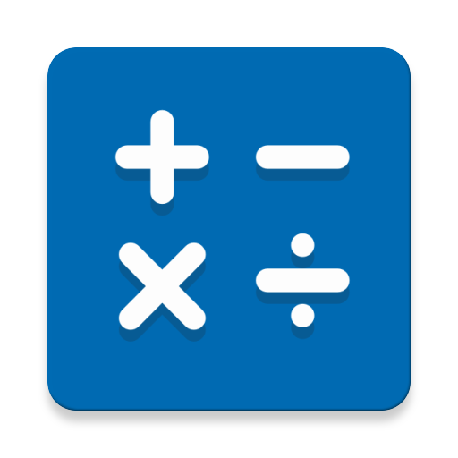

# Reworked-Calculator-C

Added custom modules ot simplify the main code file, easier to read. To who wants to contribute, simply download the source code, and if you want to add operands,
just add the functions in the operands.c file, and recall it in the main.c/cpp. 

Note: if codeblocks can't open the file because it wants a .c file, simply rename it from cpp to c.
